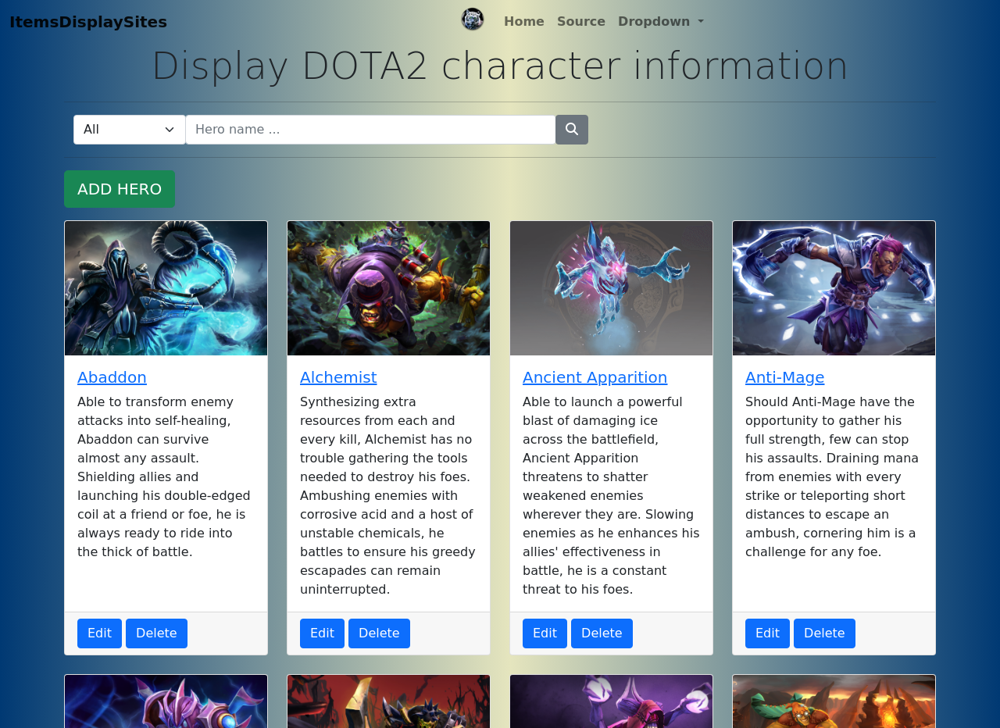
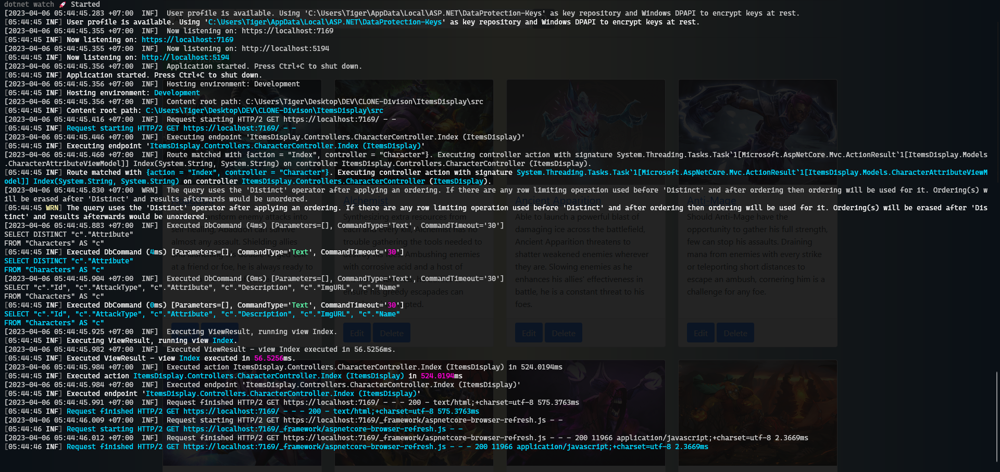

# Information display sites

[](https://github.com/h-ql/ItemsDisplay/actions)

## Introduction

This is repository of the [Dota 2 game game content website](https://itemsdisplay-vmk74xsjsa-uc.a.run.app/). This repository is a sample web application used monolithic architecture with ASP.Net Core MVC pattern.

   [](https://itemsdisplay-vmk74xsjsa-uc.a.run.app/)


## Description

The website is simple for storing to web page items been collected alongside with informations with it, below is is list function the website should do:
- Display information about the game characters.
- Able to search through characters page with hero name or alongside with specific hero attribute.
- Operate full basic Create, Read, Update, Delete action.
 

 ## Technology used
 
- FrontEnd using default Bootstrap came along with MVC .NET pattern.
- BackEnd using EFcore for ORM, database storing in SQLite for publishing and SQLServer for local development.
- APIs [Controller](https://github.com/h-ql/ItemsDisplay/blob/main/src/Controllers/CharacterController.cs) is structuring with basic service layer with full asynchronous processing.

    ``` csharp
    public interface ICharacterService 
    {
        Task<CharacterAttributeViewModel> GetAllAsync(string CharacterAttribute, string searchString);
        Task<Character> GetByIdAsync(int id);
        Task<Character> FindByIdAsync(int? id);
        Task<List<Character>> AddCharacterAsync(Character character);
        Task<List<Character>> UpdateCharacterAsync(Character character);
        Task<List<Character>> DeleteCharacterAsync(int id);
    }
    ```
    
- Website production version using Google Cloud Platform as server deployment proccessing full [Github Action CI/CD](https://github.com/h-ql/ItemsDisplay/actions) workflow with Docker container.

    ``` docker
        FROM mcr.microsoft.com/dotnet/sdk:7.0 AS build
        WORKDIR /app

        COPY ./*.sln ./
        COPY ./src/*.csproj ./src/
        COPY ./test/*.csproj ./test/
        RUN dotnet restore ./*.sln

        COPY . .
        RUN dotnet build --no-restore ./*.sln

        FROM build AS test
        WORKDIR /app/test
        RUN dotnet test --no-restore -c Release --results-directory /TestResult --logger "trx;LogFileName=itemsdisplay_Test-Results.trx" 

        FROM build AS publish
        WORKDIR /app/src
        RUN dotnet publish --no-restore -c Release -o ./out

        FROM mcr.microsoft.com/dotnet/aspnet:7.0
        WORKDIR /app
        COPY --from=publish /app/src/out ./
        ENTRYPOINT [ "dotnet", "ItemsDisplay.dll" ]
    ```

- The Website using 3rd-party libary name Serilog to configuring logging.
    ``` json
        "WriteTo": [
        {
            "Name": "Console",
            "Args": {
            "outputTemplate": "[{Timestamp:yyyy-MM-dd HH:mm:ss.fff zzz} {CorrelationId} {Level:u3}] {Username} {Message:lj}{NewLine}{Exception}"
            }
        },
        {
            "Name": "File",
            "Args": {
            "path": "../Log/serilog.log",
            "rollingInterval": "Day",
            "outputTemplate": "[{Timestamp:yyyy-MM-dd HH:mm:ss.fff zzz} {CorrelationId} {Level:u3}] {Username} {Message:lj}{NewLine}{Exception}"
            }
        }
        ]
    ```

    

 ## Re-using this project

-  Fork this repository from the and then clone it locally to your machine. This project is based on .NET Core 7.0, create a repository from the GitHub template and then clone it locally to your machine.
- Once you clone the project, navigating to repo directory then execute .NET command:

   `dotnet restore .\ItemsDisplaySites.sln`   
   `dotnet run --project .\src\`

